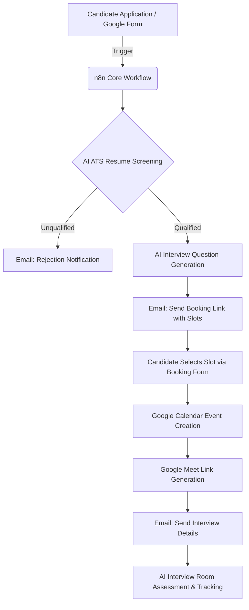
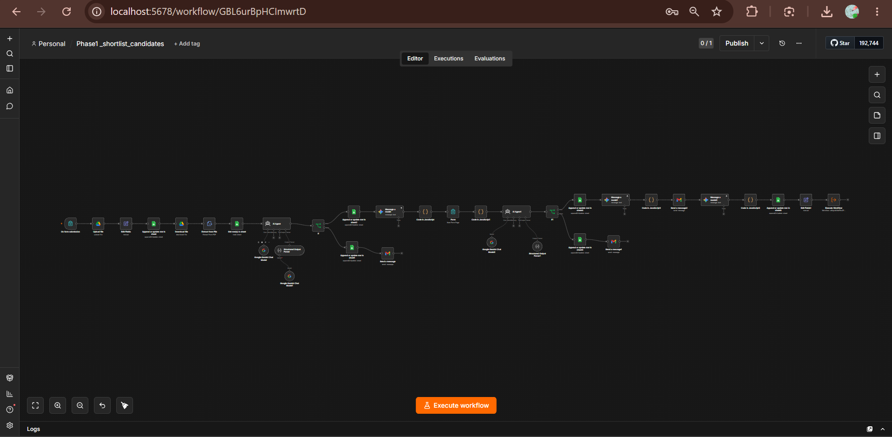

# 🚀 AI-Powered Recruitment Automation Platform

[](https://n8n.io/)
[](https://deepmind.google/technologies/gemini/)
[](https://workspace.google.com/)
[](#-project-progress)

An end-to-end intelligent recruitment automation platform designed to eliminate manual recruiter overhead. By seamlessly integrating **n8n**, **Google Gemini AI**, and **Google Workspace APIs**, the system automates everything from resume screening to scheduling Google Meet interviews.

---

## 📌 Project Overview & Architecture

Modern recruitment is bogged down by manual screening, endless back-and-forth emails, and complex scheduling. This platform automates the entire pipeline:



### Key Workflow Highlights
* **Automated ATS Screening:** Extracts skills, analyzes resume content, and generates a relative score based on target role criteria.
* **Intelligent Question Generation:** Leverages Google Gemini to formulate tailor-made technical and soft-skills questions using candidate resumes and target profiles.
* **Autonomous Scheduling & Calendar Management:** Handles calendar bookings, automatically resolving conflicts and generating Google Meet video links dynamically.

---

## 📸 Workflow Dashboards & Visuals

Here is the high-level architecture and running workflows inside n8n:

### 🌟 Overall Workflow Dashboard


### 📋 Phase 1: ATS Screening & Shortlisting Workflow


### 📅 Phase 2: Send Interview Slots Workflow


### 🗓️ Phase 2A: Slot Booking Workflow


---

## 🛠 Tech Stack

| Domain | Technology / Service |
| :--- | :--- |
| **Workflow Automation** | `n8n` |
| **AI & LLM Cognitive Layer** | `Google Gemini AI` |
| **Integrations & Communication** | `Google Sheets`, `Google Forms`, `Gmail`, `Google Calendar`, `Google Meet` |
| **Backend API (Upcoming)** | `FastAPI (Python)` |
| **Frontend UI (Upcoming)** | `React`, `Tailwind CSS` |
| **AI Interview Engine (Upcoming)**| `Faster Whisper`, `Vector Embeddings`, `RAG`, `OpenCV`, `PostgreSQL` |

---

## 📂 Repository Structure

The core workflows and screenshots are structured as follows:

```text
AI-Recruitment-Automation-System/
├── workflows/
│   ├── Phase1 _shortlist_candidates.json       # ATS screening & AI evaluation
│   ├── Phase2_send interview slots.json        # Dynamic slot selector & email dispatcher
│   └── Phase2 A Slot_Booking.json              # Slot confirmation & Meet generator
├── screenshots/
│   ├── workflows dashboard.png                 # Master view of automation pipelines
│   ├── phase1_shortlist_candidates_workflow.png # Visual of screening node network
│   ├── phase 2 send_interview_slots_workflow.png# Visual of email/slots scheduler
│   └── phase2 A slot_booking_workflow.png      # Visual of calendar event workflow
└── README.md
```

---

## 📈 Project Progress

### 🟩 Phase 1 — HR Core Engine
**Status: ✅ Completed (95%)**
* [x] Form-based candidate application parsing.
* [x] AI-powered resume understanding and skill extraction.
* [x] Relative ATS score calculation based on target role parameters.
* [x] Dynamic context-aware candidate assessment questions.
* [x] Sheets integration for real-time candidate logging.

### 🟩 Phase 2 — Recruitment Pipeline
**Status: ✅ Completed (85%)**
* [x] Automation of interview slot invitation dispatch.
* [x] Interactive booking page linking with Google Sheets/Calendar.
* [x] Automatic slot-conflict check and resolution.
* [x] Calendar event dispatching with unique Google Meet URLs.
* [x] Email automation for candidate confirmation.

### 🟨 Phase 3 — AI Interview Room
**Status: 🚧 In Progress (30%)**
* [ ] Real-time speech-to-text transcript processing using **Faster Whisper**.
* [ ] Real-time transcript assessment using Google Gemini.
* [ ] Comprehensive grading system: Technical Skills, Communication & Problem Solving.
* [ ] Evaluation summaries exported to spreadsheet metrics.

### ⬜ Phase 4 — Intelligence & Analytics
**Status: ⏳ Planned**
* [ ] Candidate ranking dashboards based on compound screening/interview metrics.
* [ ] Automated recruiter notifications for top-tier matches.

### ⬜ Phase 5 — Web Dashboard (Frontend/Backend)
**Status: ⏳ Planned**
* [ ] React + Tailwind CSS dashboard UI for recruiters to override/view status.
* [ ] FastAPI web-service handling sessions and secure API transactions.

---

## 🚀 Future Roadmap & Milestones

* **Milestone 1:** Finalize the AI Interview Room module integrating Faster Whisper transcription.
* **Milestone 2:** Migrate datastore elements to PostgreSQL and develop user session management logic.
* **Milestone 3:** Release Web UI dashboard for recruiter actions and candidates' status lookup.
* **Milestone 4:** Introduce OpenCV-based video monitoring and anti-cheating tracking for virtual assessments.

---

## 👨‍💻 Author

**Yuvaraja Tummalacheruvu**
*Aspiring AI Engineer | Machine Learning Enthusiast | Automation Developer*

Driven to build smart systems that merge generative AI models with workflow automation engines to solve practical enterprise bottlenecks.

---
*Developed as part of the AI Recruitment Automation System.*
