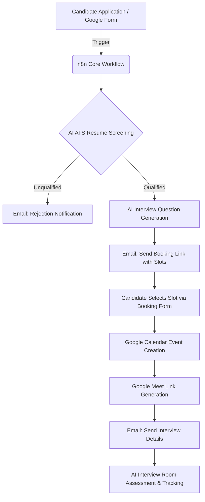
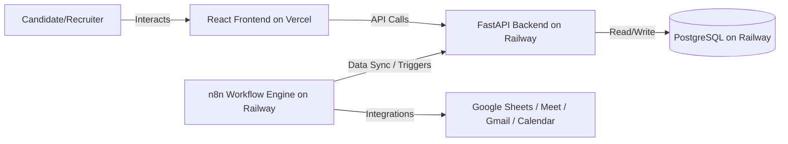

# 🚀 HireFlow: AI-Powered Recruitment Automation Platform

[](https://n8n.io/)
[](https://deepmind.google/technologies/gemini/)
[](https://workspace.google.com/)
[](#-project-progress)

An end-to-end intelligent recruitment automation platform designed to eliminate manual recruiter overhead. By seamlessly integrating **n8n workflow automation**, **Google Gemini AI**, **FastAPI Backend**, and a **React Frontend**, the system automates everything from candidate screening to scheduling and conducting AI-driven interviews.

---

## 📌 Project Overview & Architecture

Modern recruitment is bogged down by manual screening, endless back-and-forth emails, and complex scheduling. This platform automates the entire pipeline:



### Key Workflow Highlights
* **Automated ATS Screening:** Extracts skills, analyzes resume content, and generates a relative score based on target role criteria.
* **Intelligent Question Generation:** Leverages Google Gemini to formulate tailor-made technical and soft-skills questions using candidate resumes and target profiles.
* **Autonomous Scheduling & Calendar Management:** Handles calendar bookings, automatically resolving conflicts and generating Google Meet video links dynamically.

---

## 🛠 Tech Stack

| Domain | Technology / Service |
| :--- | :--- |
| **Frontend UI** | `React (Vite)`, `Tailwind CSS`, `Framer Motion`, `Lucide Icons` |
| **Backend API** | `FastAPI (Python 3.10)`, `SQLAlchemy`, `Uvicorn` |
| **Workflow Automation** | `n8n` |
| **AI & Cognitive Layer** | `Google Gemini AI (gemini-1.5-flash)` |
| **AI Audio Engine** | `Faster Whisper` (Speech-to-Text) |
| **Datastore** | `PostgreSQL` (Production), `SQLite` (Development) |
| **Integrations** | `Google Sheets`, `Google Forms`, `Gmail`, `Google Calendar`, `Google Meet` |

---

## 📂 Repository Folder Structure

The repository is structured logically to separate frontend, backend, workflows, and screenshots:

```text
AI-Recruitment-Automation-System/
├── backend/                       # FastAPI Python Backend
│   ├── routers/                   # API Routers (Candidates, Auth, Jobs, etc.)
│   ├── routes/                    # API Routes (Interview engine)
│   ├── services/                  # Cognitive Services (Gemini, Auth, n8n, etc.)
│   ├── Dockerfile                 # Railway Production Container Build Config
│   ├── Procfile                   # Process configuration for cloud deployments
│   ├── railway.json               # Railway build/deploy settings
│   ├── requirements.txt           # Python backend dependencies
│   ├── runtime.txt                # Target Python runtime version
│   └── main.py                    # Entry point for backend API
├── frontend/                      # React SPA Frontend (Vite)
│   ├── src/                       # Source components, assets, pages
│   ├── package.json               # Frontend dependencies & npm scripts
│   ├── tailwind.config.js         # Tailwind styling configs
│   ├── vercel.json                # Single Page App URL rewrites for Vercel
│   └── vite.config.js             # Vite compilation configuration
├── workflows/                     # Exported n8n workflow JSON blueprints
│   ├── Phase1 _shortlist_candidates.json
│   ├── Phase2_send interview slots.json
│   └── Phase2 A Slot_Booking.json
├── docs/                          # Detailed system documentation
│   └── deployment.md              # Production deployment guide
├── screenshots/                   # Dashboard and workflow screenshots
│   └── workflows dashboard.png
├── README.md                      # Primary project overview
└── run.bat                        # Batch script for launching local dev servers
```

---

## 🌐 Production Deployment Architecture

The platform is designed to be hosted in a multi-tenant cloud setup:



- **Frontend → Vercel:** Serves compiled static assets with fast edge delivery and SPA routing logic.
- **Backend → Railway:** Runs FastAPI in a Docker container with custom system libraries (including `ffmpeg` for Whisper speech-to-text).
- **PostgreSQL → Railway:** Fully-managed relational database cluster linked to the FastAPI backend.
- **n8n → Railway:** Autonomous server running automation triggers to coordinate Google Forms, Gmail, Calendar, and Sheets.

---

## 🔑 Environment Variables Required

Ensure these environment variables are set in your local configurations or cloud provider dashboards:

### Frontend Environment Variables
* `VITE_N8N_FORM_URL`: The public URL of the n8n application form (displays on the apply button).
* `VITE_API_URL`: The URL of your backend API (e.g. `http://localhost:8000` or `https://backend.up.railway.app`).

### Backend Environment Variables
* `GEMINI_API_KEY`: Required. Google Gemini key for generating questions and evaluating candidate logs.
* `DATABASE_URL`: Optional (falls back to local SQLite). PostgreSQL connection string for saving candidate and job metrics in production.
* `JWT_SECRET`: Optional (has local fallback). Encryption secret for signing recruiter authentication tokens.
* `N8N_WEBHOOK_URL`: Optional. URL webhook to notify n8n of new candidates.

---

## 🚀 Installation & Local Running Guide

Follow these steps to launch the entire ecosystem locally:

### Prerequisites
- Python 3.10+ installed
- Node.js (v18+) and npm installed
- FFmpeg installed (required locally for `faster-whisper` speech-to-text validation)

### Step 1: Run the Backend
1. Navigate to the backend directory:
   ```bash
   cd backend
   ```
2. Create a virtual environment and install dependencies:
   ```bash
   python -m venv venv
   # On Windows:
   .\venv\Scripts\activate
   # On macOS/Linux:
   source venv/bin/activate
   
   pip install -r requirements.txt
   ```
3. Create your `.env` file based on `.env.example` and add your `GEMINI_API_KEY`.
4. Start the server using Uvicorn:
   ```bash
   uvicorn main:app --reload --port 8000
   ```
   *The documentation is available at [http://127.0.0.1:8000/docs](http://127.0.0.1:8000/docs).*

### Step 2: Run the Frontend
1. Navigate to the frontend directory:
   ```bash
   cd ../frontend
   ```
2. Install npm modules:
   ```bash
   npm install
   ```
3. Start the Vite local server:
   ```bash
   npm run dev
   ```
   *Open [http://localhost:5173](http://localhost:5173) in your browser.*

### ⚡ Easy Dev Launch (Windows)
If you are on Windows, you can double-click **`run.bat`** at the root of the repository to spin up both the frontend and backend servers automatically in separate CMD panels.

---

## 📈 Project Progress & Roadmap

### 🟩 Phase 1 — HR Core Engine (Completed)
- [x] Parse candidate applications from form workflows.
- [x] Skill extraction and resume profiling via Google Gemini.
- [x] Scoring metrics based on target job postings.
- [x] Logging of screened candidate details to database.

### 🟩 Phase 2 — Recruitment Automation (Completed)
- [x] Dynamic interview slots calendar mapping.
- [x] Automation of invitation delivery via Gmail.
- [x] Slot booking UI with calendar conflicts resolution.
- [x] Generation of secure Google Meet URLs.

### 🟨 Phase 3 — AI Interview Room (In Progress)
- [ ] Real-time audio transcription via **Faster Whisper**.
- [ ] AI-driven response grading: Technical Skills, Communication, and Completeness.
- [ ] Candidate dashboards with automated recruiter insights.

---

## 👨‍💻 Author

**Yuvaraja Tummalacheruvu**
*Aspiring AI Engineer | Machine Learning Enthusiast | Automation Developer*

*Developed as part of the AI Recruitment Automation System.*
