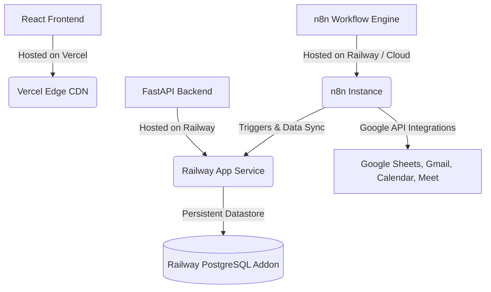

# HireFlow AI Recruitment Platform - Deployment Guide

This guide outlines the production deployment setup for the HireFlow AI Recruitment Platform. The system architecture is designed to be hosted on cloud-native platforms, utilizing **Vercel** for the frontend, **Railway** for the FastAPI backend, PostgreSQL, and n8n workflows.

---

## 🗺️ Deployment Architecture

---

## 🎨 1. Frontend Deployment (Vercel)

The React and Vite frontend is optimized for deployment on Vercel.

### Deployment Steps:
1. **GitHub Integration:** Link your GitHub repository to your Vercel account.
2. **Import Project:** Select the repository and set the **Root Directory** to `frontend`.
3. **Framework Preset:** Vercel will automatically detect the **Vite** preset.
4. **Environment Variables:**
   - Add `VITE_N8N_FORM_URL` with your n8n public form URL.
   - Add `VITE_API_URL` pointing to your deployed Railway backend URL (e.g., `https://hireflow-backend.up.railway.app`).
5. **Build and Deploy:** Click **Deploy**. Vercel will compile the Vite assets and deploy them to an edge CDN.

---

## ⚙️ 2. Backend & PostgreSQL Deployment (Railway)

The FastAPI backend runs inside a Docker container on Railway and connects to a Railway-managed PostgreSQL database.

### Deployment Steps:
1. **Create a Railway Project:** Log in to Railway and create a new project.
2. **Add PostgreSQL Database:** Add the **PostgreSQL** database service to your project. This automatically generates a internal `DATABASE_URL` environment variable.
3. **Add Backend Service:** Add a new service from your GitHub repository.
4. **Configure Subdirectory:** Set the **Root Directory** in the service settings to `backend`.
5. **Builder Type:** Set the builder to **Docker** (Railway will automatically build using the provided `Dockerfile`).
6. **Configure Environment Variables:** Link the PostgreSQL database to the backend service. Railway will automatically inject `DATABASE_URL`. Add `GEMINI_API_KEY` and `JWT_SECRET`.
7. **Deploy:** The service will build and deploy, exposing a public URL (e.g., `https://hireflow-backend.up.railway.app`).

---

## 🔄 3. n8n Workflow Deployment (Railway)

To host the n8n workflows in the cloud:
1. **Deploy n8n Template:** You can deploy n8n on Railway using the official n8n community template.
2. **Configure Database:** Link it to your PostgreSQL database instance for persistence.
3. **Import Workflows:** Import the workflows located in the `/workflows` directory:
   - `Phase1 _shortlist_candidates.json`
   - `Phase2_send interview slots.json`
   - `Phase2 A Slot_Booking.json`
4. **Link Credentials:** Authenticate the n8n nodes with your Google Workspace Account (for Gmail, Google Sheets, Google Calendar, Google Meet) and configure the Gemini API node with your Gemini Key.

---

## 🔑 Required Environment Variables Reference

### Frontend Variables
| Variable | Required | Description / Value |
| :--- | :--- | :--- |
| `VITE_N8N_FORM_URL` | Yes | URL of the n8n form for candidate applications. |
| `VITE_API_URL` | Yes | HTTP URL of the deployed FastAPI backend. |

### Backend Variables
| Variable | Required | Description / Value |
| :--- | :--- | :--- |
| `DATABASE_URL` | Yes | PostgreSQL connection string (Automatically injected by Railway). |
| `GEMINI_API_KEY` | Yes | Google Gemini API key for evaluating resumes and generating questions. |
| `JWT_SECRET` | Yes | Signature key for token signing (should be a secure, random string). |
| `N8N_WEBHOOK_URL` | No | Optional webhook URL pointing to the n8n automation flow. |
